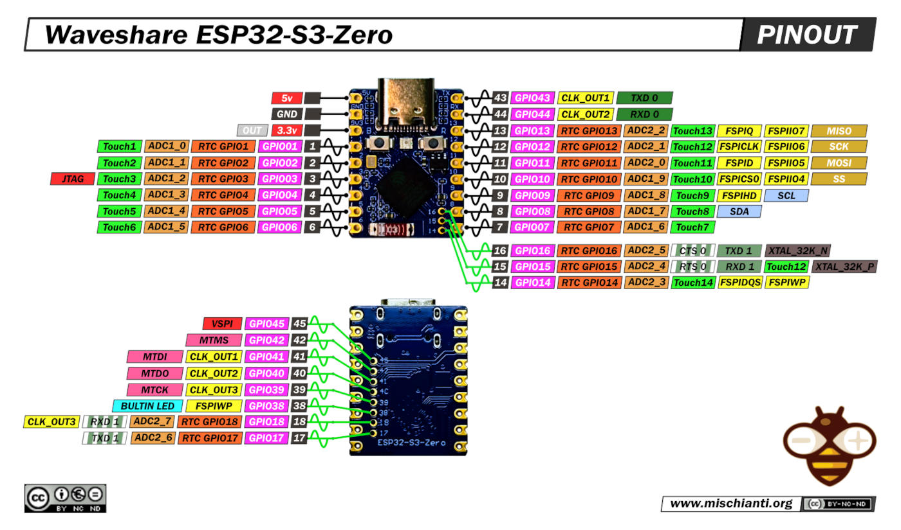

MecSveglia — ESP32-S3 Zero clock/desk companion

- Piattaforma: ESP32‑S3 (Waveshare ESP32‑S3‑Zero)
- Display: OLED SSD1306 128×32 I2C (addr 0x3C)
- Funzioni: ora via NTP (Europe/Rome), meteo OpenWeatherMap, pagine web su SPIFFS/LittleFS, mDNS, OTA, animazioni (occhi, Game of Life, triangolo), ciclo schermi automatico, attenuazione notturna e anti burn‑in.

Pinout della board: vedi immagine in `info/esp32-S3-Zero-Waveshare-pinout-low.jpg`.



Requisiti

- VS Code + PlatformIO (framework Arduino)
- Librerie auto‑gestite da PlatformIO: `Adafruit SSD1306`, `Adafruit GFX`, `ArduinoJson`, `Adafruit NeoPixel`

Struttura progetto

- Codice sorgente: `src/`
- File web e configurazione su filesystem: `data/` (caricati su SPIFFS)
- Definizioni scheda e pinout: `info/`
- Modelli per stampa 3D: `stl/` (es. `stl/mec01.stl`, `stl/mac02.stl`)

Configurazione scheda in PlatformIO

Questo progetto usa la board `esp32-s3-fh4r2` (4 MB flash QIO + 2 MB PSRAM). Per farla riconoscere a PlatformIO hai due opzioni:

1) Usare il repository esterno con molte board predefinite:
- Repo: https://github.com/sivar2311/platformio_boards
- Segui le istruzioni del repo per installare/aggiornare le definizioni. Dopo l’installazione, la voce `board = esp32-s3-fh4r2` nel file `platformio.ini` funzionerà senza altre modifiche.

2) Usare il file incluso in questo repo:
- Il JSON della board è in `info/esp32-s3-fh4r2.json`.
- Opzione A (consigliata per progetto locale): aggiungi in cima a `platformio.ini`:

```
[platformio]
boards_dir = info
```

- Opzione B: copia `info/esp32-s3-fh4r2.json` nella tua cartella `boards` personalizzata di PlatformIO (vedi documentazione `boards_dir`).

File `platformio.ini`

- Ambiente attivo: `[env:esp32-s3-fh4r2]`
- Piattaforma: `espressif32`
- Framework: `arduino`
- File system: SPIFFS con partizioni da `partitions.csv`
- Flag principali: USB CDC su boot abilitato

Caricamento firmware e filesystem

- Firmware: compila e carica con PlatformIO (Upload)
- File web: carica la partizione SPIFFS con “Upload Filesystem Image”

Contenuti consigliati in `data/`

- `INDEX.HTM` pagina principale (home)
- `SETUP.HTM` pagina di configurazione Wi‑Fi/mdns
- `WIFI_SID.TXT` e `WIFI_PWD.TXT` credenziali Wi‑Fi
- `MDNS_NM.TXT` nome mDNS/SSID AP di fallback (default `MECSVEGLIA`)
- `SCREEN.TXT` numero schermo di avvio (0..6, opzionale)
- `METEO_API.TXT` query string di OpenWeatherMap dopo il `?` (esempio: `id=3175384&cnt=1&units=metric&lang=it&appid=XXXX`)

Uso rapido

- Avvio in STA: se presenti SSID/PWD su SPIFFS, il dispositivo si collega al Wi‑Fi e risponde a `http://<mdns>.local` (es. `http://MECSVEGLIA.local`).
- Fallback AP: se mancano credenziali o la rete non è disponibile, crea un AP aperto con SSID `<mdns>` e mostra l’IP sul display.
- Endpoint utili: `/` home, `/setup`, `/status` (JSON), `/wifi`, `/time`, `/eyes`, `/meteo`, `/tri`, `/gol`, `/cycle`, `/oled`.

Hardware

- Display SSD1306 I2C 128×32 a 3.3V, indirizzo 0x3C (default). Collega SDA/SCL ai pin I2C della board come da pinout.
- Pulsante su `GPIO12` in modalità pull‑up interna: collega a GND per avanzare manualmente tra gli schermi.

Stampa 3D

- I modelli sono nella cartella `stl/`. Scegli l’alloggiamento più adatto (`mec01.stl`, `mac02.stl`) e stampa con materiale a tua scelta.

Note

- Il progetto abilita OTA: gli aggiornamenti possono essere inviati via rete quando il dispositivo è connesso.
- Il display si attenua di notte e applica un breve invert periodico per ridurre il burn‑in.

